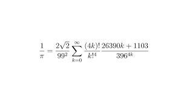
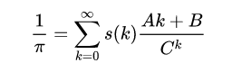
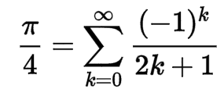
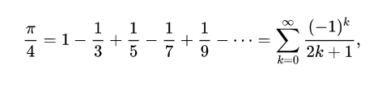
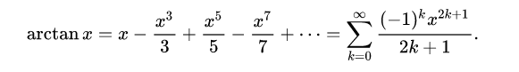

# Advanced Multithreading

## The problem of calculating Pi

### Solution 
Srinivasa Ramanujan was an Indian mathematician who made substantial contributions to mathematical analysis, number theory, infinite series, and continued fractions. 
Despite having almost no formal training in mathematics, he independently developed thousands of theorems, identities, and equations. 
His work has had a profound impact on various fields of mathematics, and he is widely regarded as one of the greatest mathematical geniuses of all time.

Mikio Sato was a prominent Japanese mathematician known for his contributions to algebraic analysis, particularly the theory of hyper functions. 
He introduced the theory of sheaf theory into the study of hyper functions, which greatly influenced the development of this field. 
Sato's work also had applications in mathematical physics, such as quantum field theory. 
He was a professor at the University of Tokyo and played a significant role in advancing mathematics in Japan and internationally.

In this assignment, i have used the Ramanujan–Sato series formula to calculating the Pi number.
The Ramanujan-Sato series is a remarkable formula discovered by mathematicians Srinivasa Ramanujan and Koji Sato. 
It is a rapidly converging series that provides a computationally efficient method for approximating certain mathematical constants, particularly those related to π (pi). 
Its discovery showcases the beauty and elegance of mathematical insight and the power of collaboration across different generations and cultures in advancing mathematical knowledge.
In mathematics, a Ramanujan–Sato series generalizes Ramanujan’s pi formulas such as,

to the form

by using other well-defined sequences of integers s ( k ) {\displaystyle s(k)} obeying a certain recurrence relation, sequences which may be expressed in terms of binomial coefficients ( n k ) {\displaystyle {\tbinom {n}{k}}}, and A , B , C {\displaystyle A,B,C} employing modular forms of higher levels.
Ramanujan made the enigmatic remark that there were "corresponding theories", but it was only recently that H. H. Chan and S. Cooper found a general approach that used the underlying modular congruence subgroup Γ 0 ( n ) {\displaystyle \Gamma _{0}(n)}, while G. Almkvist has experimentally found numerous other examples also with a general method using differential operators.
Levels 1–4A were given by Ramanujan (1914), level 5 by H. H. Chan and S. Cooper (2012), 6A by Chan, Tanigawa, Yang, and Zudilin, 6B by Sato (2002), 6C by H. Chan, S. Chan, and Z. Liu (2004), 6D by H. Chan and H. Verrill (2009), level 7 by S. Cooper (2012), part of level 8 by Almkvist and Guillera (2012), part of level 10 by Y. Yang, and the rest by H. H. Chan and S. Cooper.
The notation jn(τ) is derived from Zagier and Tn refers to the relevant McKay–Thompson series.

### Implementation
My Java code calculates the value of π using the Ramanujan-Sato series formula. 
Here's an overview of what I've done:

1. Package and Class Structure: I've organized my code into a package named sbu.cs.CalculatePi, and within it, i have a class named PiCalculator.
2. Imports: I've imported necessary classes from (java.math) and java.util.concurrent packages for mathematical operations and multithreading.
3. Inner Class: I've defined an inner static class named piCalculator which implements the Runnable interface. 
This class represents the individual calculation task for each term in the series.
4. Fields and Methods:

    - n: An integer field representing the iteration count for the series.
    - mathContext: A MathContext object used to specify precision for BigDecimal calculations.
    - seriesSum: A static BigDecimal variable used to accumulate the sum of series terms.
    - addToSum(BigDecimal seriesNumber): A synchronized method to add a series term to the sum.
    - factorial(int number): A method to calculate the factorial of a given number using BigDecimal.
    - run(): The run() method from the Runnable interface. It calculates a term of the series and adds it to the sum.
   
5. calculate(int floatingPoint): This method orchestrates the calculation process. 
It creates an ExecutorService with a fixed pool size, submits calculation tasks for each term in the series, waits for their completion, and then performs the final computations to approximate π. 
It returns the result as a string with the specified number of floating-point digits.
6. main(): The main method where the calculation is initiated by calling calculate() with the desired precision and printing the result.

Overall, my code efficiently utilizes multithreading to distribute the calculation workload across multiple threads, improving performance for such intensive computations. 
The use of BigDecimal ensures high precision in the calculations.

### Pre algorithms
Before I used the Ramanujan–Sato series formula I had used the Leibniz series formula to calculating the Pi number. 

In mathematics, the Leibniz formula for π, named after Gottfried Wilhelm Leibniz, states that

an alternating series.
It is sometimes called the Madhava–Leibniz series as it was first discovered by the Indian mathematician Madhava of Sangamagrama or his followers in the 14th–15th century (see Madhava series), and was later independently rediscovered by James Gregory in 1671 and Leibniz in 1673. The Taylor series for the inverse tangent function, often called Gregory's series, is

It also is the Dirichlet L-series of the non-principal Dirichlet character of modulus 4 evaluated at s = 1 , {\displaystyle s=1,} and therefore the value β(1) of the Dirichlet beta function.

### Advantages
Here are some advantages of Ramanujan-Sato series formula over other algorithms:

1. Rapid Convergence: The series converges quickly, allowing for efficient computation of many digits of π with relatively few terms.
2. Efficiency: Compared to some other methods, such as iterative algorithms or Monte Carlo simulations, the Ramanujan–Sato formula can produce accurate results with fewer computations.
3. High Precision: The formula is capable of computing π to a high degree of precision, making it useful in applications where exact values are required, such as scientific calculations or cryptography.
4. Analytical Expression: The formula provides an analytical expression for π, which can be advantageous in theoretical mathematics and for understanding the properties of π.
5. Cultural Significance: The collaboration between Ramanujan and Kanada, two renowned mathematicians from different backgrounds, adds cultural significance to the formula and highlights the universality of mathematics.

Overall, the Ramanujan–Sato formula offers a powerful and efficient method for computing π, especially when high precision and rapid convergence are desired.

## Semaphore 

### Explanation and Usages
The semaphore algorithm is a synchronization technique used in multithreading to prevent race conditions, where multiple threads try to access a shared resource simultaneously, potentially leading to unpredictable behavior. 
Here's a brief overview of how semaphores work:

1. Semaphore Initialization: Semaphores are initialized with an integer value representing the number of available resources or slots.
2. Acquiring Resources: When a thread wants to access a shared resource, it must first "acquire" a semaphore associated with that resource. 
If the semaphore value is greater than zero, the thread decrements the semaphore value and proceeds. 
If the semaphore value is zero, the thread blocks until a resource becomes available.
3. Releasing Resources: When a thread finishes using a shared resource, it "releases" the semaphore associated with that resource by incrementing its value. 
This allows other threads to acquire the resource.

In the context of race conditions, semaphores help ensure that only one thread can access a shared resource at a time, preventing data corruption or inconsistent results.
There are two types of semaphores:

1. Binary Semaphores: Also known as mutexes (mutual exclusion semaphores), they have only two states: 0 and 1. They are typically used to protect critical sections of code where only one thread should execute at a time.
2. Counting Semaphores: These can have values greater than 1 and are used to control access to a finite number of identical resources. They allow multiple threads to access a resource simultaneously, up to a specified limit.

Overall, semaphores provide a flexible mechanism for managing access to shared resources in multithreaded environments and help prevent race conditions.

#### References
https://en.wikipedia.org/wiki/Srinivasa_Ramanujan

https://en.wikipedia.org/wiki/Mikio_Sato

https://en.wikipedia.org/wiki/Ramanujan%E2%80%93Sato_series

https://en.wikipedia.org/wiki/Leibniz_formula_for_%CF%80

